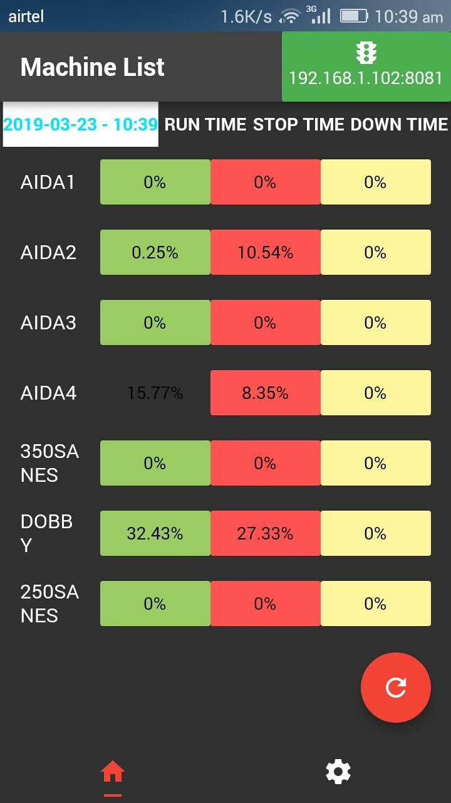
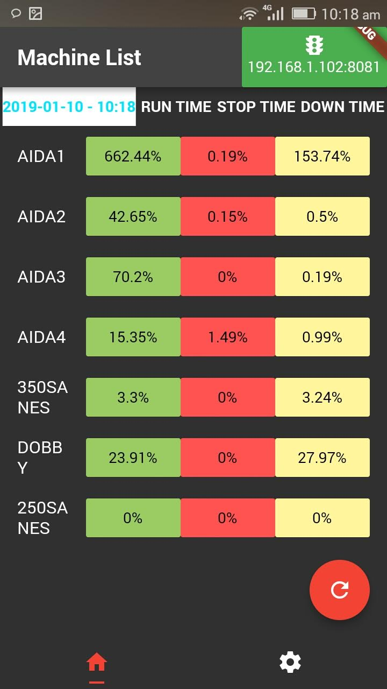

## Production Monitoring for Manufacturers

This application invloves real-time observation, tracking, and analysis of manufacturing processes to improve efficiency, quality, and productivity by identifying downtime using automated data collection from machines, sensors, and systems, moving beyond traditional manual methods for faster, more accurate decision-making.

## Built using :

	Flask : Python Based mini-Webframework
	MongoDB : Database Server
	Pymongo : Database Connector ( For creating connectiong between MongoDB and Flask )
	HTML5 (jinja2) : For Form and Table

## Set up environment for using this repo:

	Install Python ( If you don't have already )
		`sudo apt-get install python`
		
	Install MongoDB ( Make sure you install it properly )
		`sudo apt-get install -y mongodb-org`

	Install Dependencies of the application (Flask, Bson and PyMongo)
		pip install -r requirements.txt
			

## Run :
	Run MongoDB
		1) Start MongoDB
			`sudo service mongod start`
		2) Stop MongoDB
			`sudo service mongod stop`
	
	Run the Flask file(app.py)
		`python app.py`

	Browse with any Browser to the following link and DONE !
		`http://localhost:5000'

## Screenshot

 
